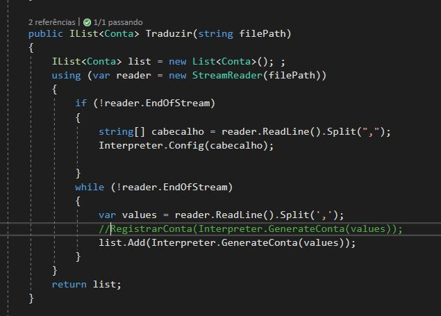

# Solução para o teste Uppertools

Projeto feito para a Uppertools como teste prático.

## Objetivo

Converter diversas consultas de faturas, com diversos mobelos e diversos formatos de arquivo em 1 unico objeto/classe.

Que será exportado a outro software responsável por gerar gráficos e relatórios.

## Considerações

- O código feito está em versão inicial focado no cerne da aplicação, algumas convenções e propriedades de mapeamento para o banco de dados foram omitidas;
- Esta proposta não engloba, o gerenciamento do pagamento;
- Presume-se que alguma tarefa a requisição seja disparada em alguma tarefa agendada, ou manualmente pelo usuário.

## Resolução

E para cada tipo de arquivo haverá um interpreter, o exemplo está usando CSV.

que será utilizado por um Leitor para ler ler o arquivo e gerar a nossa classe "Conta".

O diagrama de classes ilustra a implementação desta funcionalidade.

<div style="background-color:#fff">
    
</div>

A interface IConversor contém o comportamento obriatório dos leitores.

A classe LeitorCSV contém os procedimentos para montar a lista de contas ou faturas atráves de um arquivo CSV. Usando o interpreter para decodificar cada linha para nosso objeto final.



O método de config, é usado para fazer configurações pré-leitura, para o caso do CSV é adquiri o index da coluna com o valor referente aquela propriedade.


Enquanto que os demais métodos dessa classes fazem a atribuiçao dos valores e conversão se necessário


## Inclusão de novas contas

Para registrar mais uma conta a ser consultada cadastrar uma fatura é informado do Interpreter para o tipo de arquivo.


Os campos da classe Interpreter serão usados localizar os valores correspondentes da nossa classe.

Para o caso do csv é setado o nome das colunas que contém o valor no layout de arquivo do fornecedor.

Para cada formato de arquivo o valor desses campos mudam. Por exemplo para arquivos JSON ou XML, eles poderiam armazenar os nomes dos campos. Porém e se os valores estiverem em objetos dentro de outros objetos por exemplo:

```
{
    "object":{
        "Fatura":{
            "Valor Total":{
                "Currency":"BRL",
                "Valor":"300.00"
            }
            "Referente":"consumo mes 02/20",
            ...
        }
    }
}

```

Para estes casos podemos definir uma expressão regular ou interna para interpretar tais informações por exempla usar o caracter ">" para indicar o caminho.
Resultando "object>Fatura>Valor Total>Valor"


## Escalabilidade

Para escalarmos a aplicação, seria necessário:

1. Fazer o download do arquivo recebido em disco;
1. Distribuir a aplicação em microservicos, containers, e tudo mais.
1. Adaptar o código para trabalhar com arquivos muito grandes, processar linha por linha do arquivo, sem carregá-lo por completo na memória (algo que já acontece). usando multiplas threads se possível. Entretanto podemos melhorar ainda mais o algoritmo pois ele trabalha com strings e maném os valores da linha lida por muito tempo.
1. O método Traduzir retorna uma lista de Conta, isso teria que ser mudado para que cada conta lida, seja persistida no banco ou no arquivo de envio, atráves de uma chamada para registro do item.


## Finalizando

Esta foi uma proposta solução inicial inicial, talvez nao seja a melhor solução ou a ótima, mas com ela já temos um começo.

Desde já agradeço a oportunidade, pois foi de grande aprendizado a realização deste teste.

<br/> Josué Placido

[](https://www.linkedin.com/in/josueplacido/) | [](mailto:juplacido.jnr@gmail.com) | [](mailto:ozzyplacidojunior@hotmail.com)
